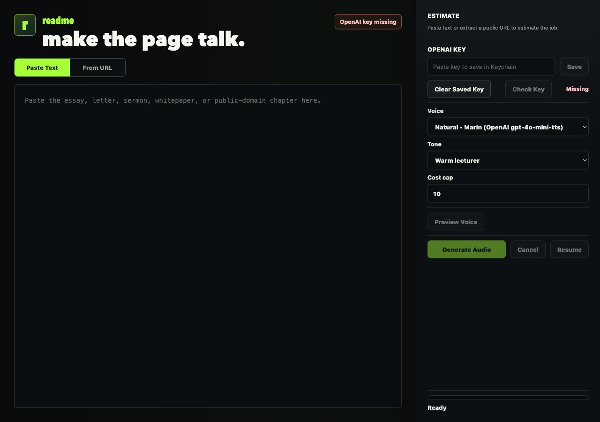

# readme

<p align="center">
  
</p>

<p align="center">
  <strong>Turn long reads into private MP3 narration on your Mac.</strong>
</p>

<p align="center">
  Paste an essay, article, letter, whitepaper, sermon, or public URL. readme estimates the cost, previews the voice, generates narration with AI text-to-speech, and saves a normal MP3 you can play anywhere.
</p>

<p align="center">
  <a href="https://github.com/cobibean/readme/stargazers"></a>
  <a href="https://github.com/cobibean/readme/blob/main/LICENSE"></a>
  
  
</p>



## Why readme exists

Some writing is worth reading closely, but not always at a desk.

readme is for the 60-page report, the sprawling blog post, the public-domain chapter, the long letter, the research memo, the sermon draft, the essay you meant to read all week. It turns that text into an audio file without turning the product into a podcast studio, dictation tool, hosted library, or subscription platform.

The goal is simple: bring your own API key, see the estimated cost before generation, create a listenable MP3, and keep the workflow local-first.

## Highlights

- **Long-form first**: built for essays, articles, letters, whitepapers, and book-length passages.
- **Cost-aware generation**: estimates characters, listening time, chunk count, and provider cost before paid calls.
- **Default job cap**: keeps the per-job cost cap at `$10` unless you raise it.
- **Voice preview**: generates a short sample before you commit to a full export.
- **URL extraction**: fetches public pages and extracts readable article text with Mozilla Readability.
- **Resumable jobs**: writes chunk audio and manifests so interrupted jobs can continue without starting over.
- **MP3 output**: stitches generated chunks into a normal MP3 for Finder, QuickTime, Music, and other players.
- **Local-first app shape**: no accounts, no hosted history, no sync service, no remote telemetry.
- **Keychain storage**: saves OpenAI API keys to the macOS Keychain where possible.
- **Provider adapter foundation**: starts with OpenAI TTS and keeps the architecture open for more providers.

## What it is not

readme is intentionally narrow.

It is not a dictation app. It is not Speakeasy. It is not an ElevenLabs wrapper. It is not a podcast editor. It does not bypass paywalls, rewrite the source text, upload your library to a server, or ask you to create an account.

## Quick start

Requirements:

- macOS
- Node.js `>=20 <22`
- npm
- Xcode Command Line Tools, for the native Keychain helper
- An OpenAI API key for real narration

Clone and install:

```bash
git clone https://github.com/cobibean/readme.git
cd readme
npm ci
```

Run the web renderer and Electron app during development:

```bash
npm run dev
```

In another terminal:

```bash
npm run dev:electron
```

Build and test:

```bash
npm run build
npm test
```

Package the macOS app:

```bash
npm run package:mac
```

The packaged output is written to:

```text
release/readme-0.1.0-arm64.dmg
release/mac-arm64/readme.app
```

## API keys

For normal app use, paste your OpenAI API key into readme's settings panel. The app stores it in the macOS Keychain.

For development, you can also use:

```bash
OPENAI_API_KEY=sk-...
```

or a local `.env` file:

```bash
OPENAI_API_KEY=sk-...
```

`.env` files are ignored by git. Never commit API keys.

## Packaging notes

`npm run package:mac` builds the TypeScript main process, Vite renderer, native Keychain helper, Electron app bundle, and DMG.

On machines without Apple signing and notarization credentials, the app can still be packaged for local testing, but it will not be notarized for broad public distribution. A production release should be signed and notarized with an Apple Developer account.

The current package flow has been verified on Apple Silicon and produces an ARM macOS DMG.

For a complete step-by-step packaging guide, including agent checklist and troubleshooting, see [Packaging readme for macOS](docs/PACKAGING_MAC.md).

## Architecture

readme is an Electron app with a React renderer and a TypeScript main process.

```text
src/
  main/
    extraction/       Public URL fetching and Readability parsing
    jobs/             Chunk generation, progress, manifests, resume flow
    providers/        TTS provider adapters
    quick-read/       macOS quick-read experiments and floating controls
    audio/            ffmpeg stitching
    keychain.ts       macOS Keychain integration
  renderer/
    App.tsx           Main desktop UI
    styles.css        App styling
  shared/
    costs.ts          Voice metadata and cost estimation
    chunker.ts        Text chunking
    tones.ts          Tone presets
    types.ts          Shared IPC and job types
```

The main process owns network calls, API keys, file writes, and audio assembly. The renderer owns the interactive workflow and receives progress updates through IPC.

## Development scripts

| Command | What it does |
| --- | --- |
| `npm run dev` | Builds native/main code and starts Vite on `127.0.0.1` |
| `npm run dev:electron` | Opens Electron against the local Vite server |
| `npm run build` | Builds the native helper, main process, and renderer |
| `npm test` | Runs the Vitest suite |
| `npm run package:mac` | Builds and packages a macOS DMG |

## Roadmap

- AWS Polly adapter for reliable, predictable MP3 generation.
- Google Cloud voice adapter after quality and setup testing.
- Better provider comparison inside the app.
- Chapterized output for long documents.
- PDF import.
- More robust resume diagnostics.
- Public release signing and notarization.

## Project docs

- [Product requirements](docs/PRD.md)
- [Provider research](docs/RESEARCH.md)
- [macOS packaging guide](docs/PACKAGING_MAC.md)
- [Launch plan](docs/LAUNCH_PLAN.md)
- [MVP implementation plan](docs/superpowers/plans/2026-05-25-longread-audio-mvp.md)

## Contributing

Issues and pull requests are welcome.

The project is still young, so the best contributions are focused and practical: bug fixes, provider adapters, packaging improvements, tests, accessibility improvements, and clear documentation.

Before opening a large PR, please start with an issue so the direction can be discussed first.

## Security and privacy

- Do not commit API keys, provider credentials, generated audio, or local job artifacts.
- Keep `.env`, `dist/`, `release/`, and `node_modules/` out of git.
- Source text is sent to the selected TTS provider during generation.
- The app does not include remote telemetry in v1.
- Users are responsible for having the rights to synthesize and save source material.

If you find a security issue, please open a private report through GitHub Security Advisories if available, or contact the maintainer directly.

## Maintainer

Built by [@cobi_bean](https://twitter.com/cobi_bean).

If readme is useful or interesting, a star helps more people find it.

## License

MIT. See [LICENSE](LICENSE).
