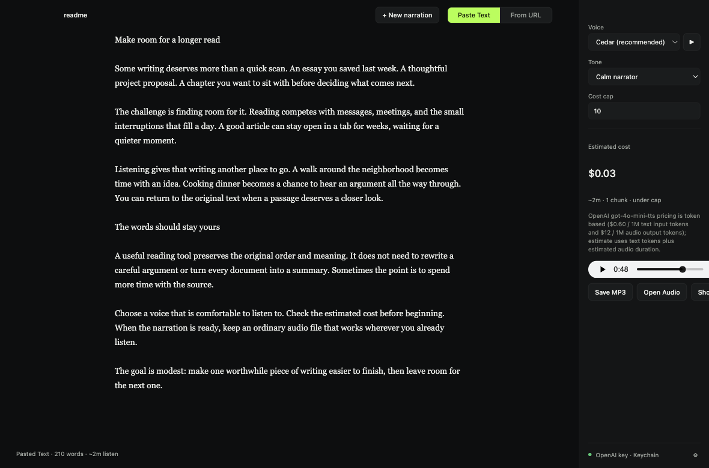

# readme

<p align="center">
  
</p>

<p align="center">
  <strong>Turn long reads into audio you can take with you.</strong>
</p>

<p align="center">
  Paste text or a public URL, see the estimated cost, and generate an MP3 to listen to away from your screen.
</p>

<p align="center">
  <a href="https://github.com/cobibean/readme/blob/main/LICENSE"></a>
  
</p>

**readme** is a macOS app for people who want to listen to essays, articles, research, or long AI responses while walking, commuting, or doing something else. Bring your own OpenAI API key; source text is sent to OpenAI for narration, and generated audio and job files stay on your Mac. There is no readme account or hosted library.

Product direction, interface design, and engineering by [Jacobi Lange](https://github.com/cobibean), with AI-assisted development.



*Current interface with illustrative sample content and playback data.*

## The product decisions

The core job is simple: turn something worth reading into something worth listening to. The design focuses on the decisions and failure points around that job.

| Decision | Why it matters |
| --- | --- |
| **Show cost before generation** | Readers can check the estimate before spending. A default **$10 per-job cap** blocks jobs estimated above it until the reader raises the cap or shortens the text. Estimates may differ from the provider's final bill. |
| **Make voice preview optional** | A short sample helps the reader choose a voice before generating the full document. Once they know what they like, they can go straight to generation. |
| **Play first, save when wanted** | Completed narration plays inside the app. Exporting a standard MP3 is a separate choice, so listening does not require managing files first. |
| **Keep files local and skip accounts** | There is no readme signup, cloud library, or sync setup between the reader and their audio. The tradeoff is bringing an API key and handling files across devices yourself. |
| **Preserve completed work** | Cancelled or failed jobs can resume using completed audio chunks. A temporary failure should not mean regenerating an entire long document. |

## An iteration from using it

After finishing a narration, I wanted a clean place to start the next one. The app had a path from text to audio, but no clear action to begin again.

That led to **New narration** in the top bar. It stops playback and clears the current text, URL, audio player, and job status while preserving the voice, tone, cost cap, and saved MP3s. It is unavailable while generation or saving is in progress.

The lesson was to design the return to the next task as deliberately as the first successful result.

## Try it

The current app supports pasted text, public URL extraction, OpenAI voices and tone presets, cost estimates, voice previews, playback, MP3 export, and resuming a cancelled or failed job. The documented macOS packaging path targets Apple Silicon.

1. Add an OpenAI API key in the app's settings. It is stored in the macOS Keychain.
2. Paste text, or choose **From URL** to extract a public article.
3. Review the estimated cost, choose a voice and tone, and optionally preview the voice.
4. Select **Generate Audio**, listen in the app, and use **Save MP3** if you want an exported copy.

Build from source with the instructions below. For a double-clickable local app and release signing requirements, see the [macOS packaging guide](docs/PACKAGING_MAC.md).

## Quick start

Requirements:

- macOS
- Node.js `>=20 <22`
- npm
- Xcode Command Line Tools, for the native Keychain helper
- An OpenAI API key for real narration

Clone and install:

```bash
git clone https://github.com/cobibean/readme.git
cd readme
npm ci
```

Run the web renderer and Electron app during development:

```bash
npm run dev
```

In another terminal:

```bash
npm run dev:electron
```

Build and test:

```bash
npm run build
npm test
```

Package the macOS app:

```bash
npm run package:mac
```

The packaged output is written to:

```text
release/readme-0.1.0-arm64.dmg
release/mac-arm64/readme.app
```

## API keys

For development, you can also set `OPENAI_API_KEY` in your shell environment or a local `.env` file:

```bash
OPENAI_API_KEY=sk-...
```

`.env` files are ignored by git. Never commit API keys.

## Architecture

readme uses Electron, React, and TypeScript. The main process owns network calls, API keys, file writes, and audio assembly; the renderer owns the interface and receives progress updates through IPC.

```text
src/
  main/
    extraction/       Public URL fetching and Readability parsing
    jobs/             Chunk generation, progress, manifests, resume flow
    providers/        TTS provider adapters
    audio/            ffmpeg stitching
    keychain.ts       macOS Keychain integration
  renderer/
    App.tsx           Main desktop UI
    styles.css        App styling
  shared/
    costs.ts          Voice metadata and cost estimation
    chunker.ts        Text chunking
    tones.ts          Tone presets
    types.ts          Shared IPC and job types
```

Public URL extraction uses Mozilla Readability. Narration runs in chunks with local manifests for recovery, then ffmpeg assembles the MP3. A provider interface keeps synthesis separate from the job runner; OpenAI is the implemented provider for live narration today.

## Development scripts

| Command | What it does |
| --- | --- |
| `npm run dev` | Builds native/main code and starts Vite on `127.0.0.1` |
| `npm run dev:electron` | Opens Electron against the local Vite server |
| `npm run build` | Builds the native helper, main process, and renderer |
| `npm test` | Runs the Vitest suite |
| `npm run package:mac` | Builds and packages a macOS DMG |

## Project docs

- [Product requirements and original scope](docs/PRD.md)
- [Provider research](docs/RESEARCH.md) — dated research; verify current pricing before relying on it
- [macOS packaging guide](docs/PACKAGING_MAC.md)
- [Original MVP implementation plan](docs/superpowers/plans/2026-05-25-longread-audio-mvp.md)

Planning documents include ideas beyond the current app. The feature summary above describes what is implemented.

## Contributing

Issues and pull requests are welcome.

The project is still young, so the best contributions are focused and practical: bug fixes, provider adapters, packaging improvements, tests, accessibility improvements, and clear documentation.

Before opening a large PR, please start with an issue so the direction can be discussed first.

## Security and privacy

- Do not commit API keys, provider credentials, generated audio, or local job artifacts.
- The app does not include remote telemetry.
- URL extraction fetches public pages; it does not bypass paywalls or authentication.
- Users are responsible for having the rights to synthesize and save source material.

If you find a security issue, please open a private report through GitHub Security Advisories if available, or contact the maintainer directly.

## License

MIT. See [LICENSE](LICENSE).
